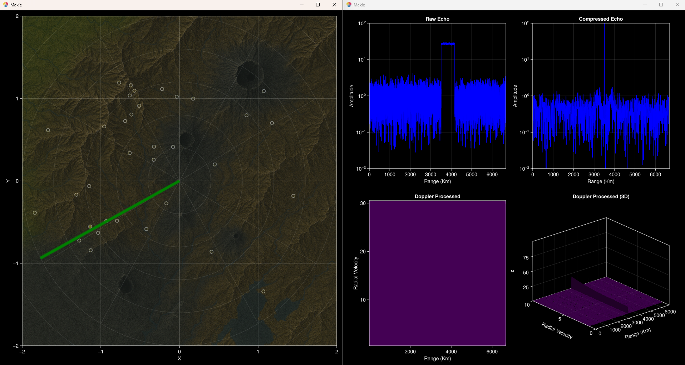

# Radar.jl

**Radar.jl** is an interactive radar simulation framework written in Julia.  
It combines physics-based signal modeling with real-time visualization to let you explore how radar systems detect and track targets. The package can be run as a simulator, or used as a foundation for experimenting with radar processing chains.

<p align="center">
  
</p>

---

## Features

- **Pulse radar simulation**  
  Implements a simple pulsed radar with configurable parameters such as carrier frequency, bandwidth, duty cycle, antenna gain, and noise temperature.

- **Target modeling**  
  Targets can be spawned in Cartesian or polar coordinates with configurable position, velocity, radar cross section (RCS), and Swerling fluctuation models.

- **Interactive visualization**  
  Real-time radar displays built with [GLMakie](https://makie.juliaplots.org/stable/) and `Plots.jl`:
  - Raw echo
  - Pulse compression
  - Doppler processing (2D/3D views)
  - Plan Position Indicator (PPI) with friend/foe/unknown markers

- **Game modes**  
  - **Visualize & Spawn** – freely place targets and watch radar responses.  
  - **Incoming!** – shoot down approaching targets with mouse clicks.  
  - **Spy Hunt (WIP)** – planned scenario mode.

- **Radar phenomenology**  
  Includes noise, clutter, and Swerling target fluctuations.

---

## Installation

1. Install Julia ≥ 1.11  
   [Download Julia](https://julialang.org/downloads/)

2. Clone this repository:
   ```bash
   git clone https://github.com/yourusername/Radar.jl.git
   cd Radar.jl
   ```

3. Activate the project and resolve dependencies:
   ```julia
   using Pkg
   Pkg.activate(".")
   Pkg.instantiate()
   ```

Dependencies are listed in `Project.toml` and pinned in `Manifest.toml`.  
Key packages include: `GLMakie`, `Plots`, `DSP`, `FFTW`, and `Distributions`.

---

## Usage

To start the simulator:

```julia
julia --project main.jl
```

On launch you will be prompted to choose a mode:

- **Visualize & Spawn**  
  - Left-click: spawn a new target at cursor location  
  - Right-click: toggle omniscient mode  

- **Incoming!**  
  - Left-click: shoot down enemies  
  - Right-click: switch radar rotation direction  

- **Quit**  
  Exit the simulator.

Example:

```text
Welcome to my radar simulator, Radar.jl!
Choose a Radar mode:
  > Visualize & Spawn
    Game
    Quit
```

---

## Configuration

Radar settings can be tuned in [`parameters.jl`](./parameters.jl). Examples:

- `radarCoverageRange = 200e3` (200 km coverage)
- `radarPower = 1e6` (1 MW transmit power)
- `radarCarrierFrequency = 9e9` (9 GHz X-band)
- `radarChirpBW = 2e6` (2 MHz chirp bandwidth)
- `terrainOccludedVisibility` – example occlusion map

---

## Extending

The codebase is modular:

- Add new target behaviors in [`target.jl`](./target.jl)  
- Implement additional Swerling or RCS models in [`swerling.jl`](./swerling.jl)  
- Extend radar processing inside `Radar.RadarProcessingChain`  
- Customize visualizations in [`RadarUI.jl`](./RadarUI.jl)  

---

## Roadmap

- [ ] Complete *Spy Hunt* game mode  
- [ ] Implement multi-channel / phased array support  
- [ ] Add export of recorded radar data  
- [ ] Support 3D environments and terrain masking  

---

## License

MIT License. See [LICENSE](LICENSE) for details.

---

## Acknowledgments

Developed by **[davidizzle](mailto:davide.ferretti.j@gmail.com)**.  
Built on top of Julia’s scientific ecosystem: Makie, DSP, FFTW, Distributions, and more.
